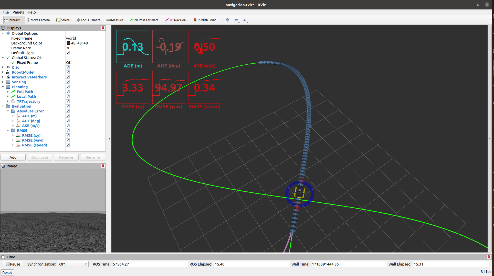
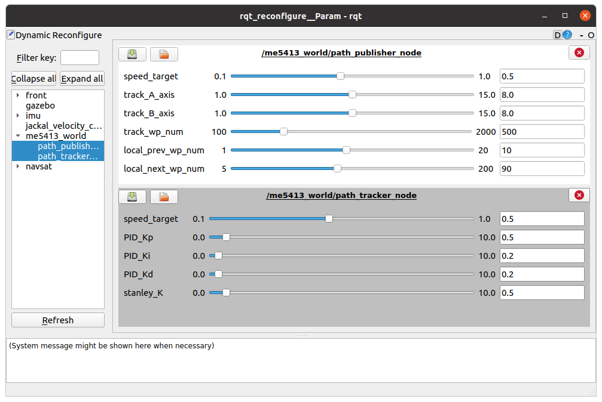

# ME5413_Planning_Project
fork from https://github.com/NUS-Advanced-Robotics-Centre/ME5413_Planning_Project.git
modify PID algorithm

## Dependencies

- System Requirements:
  - Ubuntu 20.04 (18.04 not yet tested)
  - ROS Noetic (Melodic not yet tested)
  - C++11 and above
  - CMake: 3.0.2 and above
- This repo depends on the following standard ROS pkgs:
  - `roscpp`
  - `rospy`
  - `rviz`
  - `std_msgs`
  - `nav_msgs`
  - `geometry_msgs`
  - `visualization_msgs`
  - `tf2`
  - `tf2_ros`
  - `tf2_eigen`
  - `tf2_geometry_msgs`
  - `gazebo_ros`
  - `jsk_rviz_plugins`
  - `jackal_gazebo`
  - `jackal_navigation`
  - `velodyne_simulator`
  - `dynamic_reconfigure`

## Installation

This repo is a ros workspace, containing three rospkgs:

- `me5413_world` the main pkg containing the gazebo world, source code, and the launch files
- `jackal_description` contains the modified jackal robot model descriptions

**Note:** If you are working on this project, it is encouraged to fork this repository and work on your own fork!

After forking this repo to your own github:

```bash
# Clone your own fork of this repo (assuming home here `~/`)
cd
git clone https://github.com/SnailTech07709/ME5413_Planning_Project.git
cd ME5413_Planning_Project

# Install all dependencies
rosdep install --from-paths src --ignore-src -r -y

# Build
catkin_make
# Source
source devel/setup.bash
```

## Usage

### 0. Gazebo World

This command will launch the gazebo with the project world

```bash
# Launch Gazebo World together with our robot
roslaunch me5413_world world.launch
```

### 1. Path Tracking

In the second terminal, launch the path publisher node and the path tracker node:

```bash
# Load a map and launch AMCL localizer
roslaunch me5413_world path_tracking.launch
```



## Student Tasks

- Control your robot to follow the given **figure 8** track.

  - You may use any algorithms you like.
  - Implement your algorithms in the `src/me5413_world/include/me5413_world/path_tracker_node.hpp` and `src/me5413_world/src/path_tracker_node.cpp`, to replace our template code.
  - Test your algorithms on the track & Report your tracking accuracy.

- In the template code, we have provided you:

  - A dumb **PID** controller for the throttle.
  - A weird **Stanley** controller for the steering.
  - However, both are not properly configured or tuned.

- We have provided you a dynamic reconfigure GUI that allows you to tune some of the parameters:

  

- We also provides you six topics (and visualized in RVIZ) that computes the real-time errors between your robot and the tracking path:
  - `/me5413_world/planning/abs_position_error` ([m], `std_msgs::Float32`)
  - `/me5413_world/planning/abs_heading_error` ([deg], `std_msgs::Float32`)
  - `/me5413_world/planning/abs_speed_error` ([m/s], `std_msgs::Float32`)
  - `/me5413_world/planning/rms_position_error` ([m], `std_msgs::Float32`)
  - `/me5413_world/planning/rms_heading_error` ([deg], `std_msgs::Float32`)
  - `/me5413_world/planning/rms_speed_error` ([m/s], `std_msgs::Float32`)

## Contribution

You are welcome contributing to this repo by opening a pull-request

We are following:

- [Google C++ Style Guide](https://google.github.io/styleguide/cppguide.html),
- [C++ Core Guidelines](https://isocpp.github.io/CppCoreGuidelines/CppCoreGuidelines#main),
- [ROS C++ Style Guide](http://wiki.ros.org/CppStyleGuide)

## License

The [ME5413_Planning_Project](https://github.com/NUS-Advanced-Robotics-Centre/ME5413_Planning_Project) is released under the [MIT License](https://github.com/NUS-Advanced-Robotics-Centre/ME5413_Planning_Project/blob/main/LICENSE)
